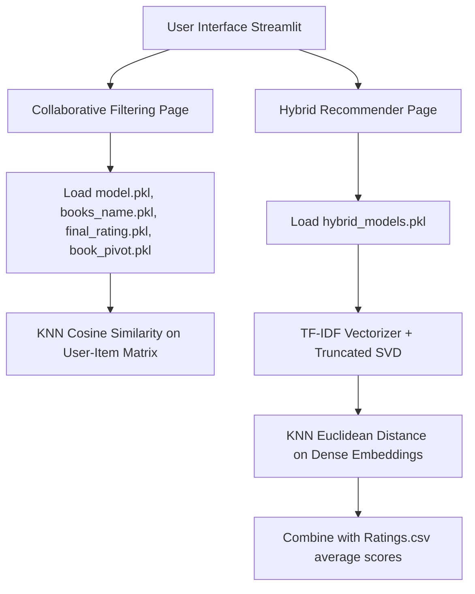

# 📚 Books Recommender System: System Architecture & Concepts

This document provides a detailed explanation of the Book Recommender System, including its design concepts, algorithms, data processing pipeline, the role of each library used, and the web interface architecture.

---

## 🗺️ System Overview

The Book Recommender System is a machine learning-powered web application built using Python and Streamlit. It implements two distinct approaches to suggesting books:
1. **Collaborative Filtering**: Suggests books based on user rating patterns (users who liked X also liked Y).
2. **Hybrid Recommendation**: Combines content metadata analysis (TF-IDF & Truncated SVD) with collaborative average ratings to produce a balanced, semantic suggestion list.



---

## 🧠 Design Concepts & Algorithms

### 1. Collaborative Filtering Recommender
*Located in:* `Collaborative_Filtering.ipynb` and `pages/CollaborativeFiltering.py`

#### The Concept
Collaborative filtering makes recommendations based on user-item interactions. In this case, the interaction is the **explicit rating** a user gives a book (on a scale of 0–10). If User A and User B both rate Book 1 and Book 2 similarly, the system assumes they have similar tastes. 

#### Data Cleaning & Handling Sparsity
Most users rate very few books, leading to a sparse user-item matrix. To improve model quality and prevent noise:
* **Active Users**: Only users who have rated **more than 100 books** are kept.
* **Popular Books**: Only books with **at least 20 ratings** are kept.

#### Model Execution
1. **Pivot Table creation**: The cleaned data is pivoted into a `book_pivot` table where **Rows = Books** ($4140$ unique books) and **Columns = Users** ($1801$ unique active users).
2. **Sparse Matrix conversion**: The table is converted to a Compressed Sparse Row (CSR) matrix using SciPy to optimize memory.
3. **K-Nearest Neighbors (KNN)**: A brute-force `NearestNeighbors` model fits this matrix.
4. **Queries**: When a user selects a book, the model finds the 5 closest books using the distance in rating space.
5. **Evaluation**: Computes the **Root Mean Squared Error (RMSE)** by comparing actual mean ratings against predicted neighbor ratings.

---

### 2. Hybrid Recommender
*Located in:* `recoomender.ipynb` and `pages/Hybrid.py`

#### The Concept
Collaborative filtering suffers from the **Cold Start problem** (it cannot recommend new books with no ratings). The Hybrid Recommender solves this by combining **Content-Based Filtering** (book metadata similarity) with **Collaborative Scoring** (average ratings).

#### Model Pipeline
1. **Text Concatenation**: A text document is created for each book by concatenating its `Book-Title`, `Book-Author`, `Publisher`, and `Year-Of-Publication`.
2. **TF-IDF Vectorization**: A `TfidfVectorizer` converts the text into a sparse numerical matrix ($271,356$ rows by $116,789$ text terms), mapping word frequencies weighted by how unique they are.
3. **Dimensionality Reduction (Truncated SVD)**: To extract semantic meaning and reduce noise, Singular Value Decomposition (SVD) compresses the $116,789$-dimensional TF-IDF vectors into a **120-component dense embedding**. This captures latent semantic relationships between books.
4. **KNN Fit**: A `NearestNeighbors` model is fitted on these dense embeddings using **Euclidean distance**.
5. **Hybrid Score Calculation**: For a target book, the system finds the 20 closest books in the semantic space. It then scores each candidate book $i$ using a weighted formula:
   $$\text{Hybrid Score}_i = \alpha \times (\text{Content Similarity}_i \times 5) + (1 - \alpha) \times \text{Collaborative Rating}_i$$
   * Where $\text{Content Similarity}_i = \frac{1}{1 + \text{Euclidean Distance}}$.
   * $\text{Collaborative Rating}_i$ is the average rating of the book in the dataset (defaulting to 3 if unrated).
   * $\alpha$ balances content vs. collaborative ratings (default = 0.5).

---

## 📦 Role of Libraries Used

Here is why each package in [requirements.txt](file:///c:/Users/User/Downloads/AI_ass/requirements.txt) is critical:

| Library | Primary Use Case in Project |
| :--- | :--- |
| **`streamlit`** | Powers the interactive web application interface. Handles page routing (`pages/` directory), sidebar navigation, selectboxes, text inputs, and dynamic UI rendering. |
| **`pandas`** | Performs data loading (`pd.read_csv`), filtering, merging, renaming columns, grouping data (e.g. counting ratings per book), and handling tabular records. |
| **`numpy`** | Essential for linear algebra operations, indexing (such as finding book IDs via `np.where`), reshaping array vectors for model queries, and mathematical calculations like RMSE (`np.sqrt` and `np.mean`). |
| **`scikit-learn` (`sklearn`)** | Provides the machine learning building blocks:<br>- `NearestNeighbors`: Fits the distance metrics to fetch nearest matching books.<br>- `TfidfVectorizer`: Transforms book metadata text into numerical vectors.<br>- `TruncatedSVD`: Reduces dimensionality to extract semantic meaning.<br>- `metrics`: Computes RMSE, Precision, Recall, and F1-Scores. |
| **`scipy`** | Used to create Compressed Sparse Row (`csr_matrix`) objects. Crucial for converting the large, memory-heavy ratings pivot table into a compact structure to speed up KNN computations. |
| **`pickle`** (built-in) | Used for serialization. Saves the trained vectorizers, embeddings, and KNN models from notebooks into binary files under `Trainedmodel/` so the web app can load them instantly without retraining. |

---

## 📂 Project Structure

```bash
AI_ass/
│
├── .venv/                      # Python virtual environment (auto-created)
├── input/                      # Raw datasets
│   └── book-recommendation-dataset/
│       ├── Books.csv           # Books metadata (Title, Author, Publisher, Year, Image URLs)
│       ├── Ratings.csv         # User explicit ratings (0-10)
│       └── Users.csv           # User profiles (Location, Age)
│
├── Trainedmodel/               # Serialized Pickle (.pkl) models
│   ├── model.pkl               # Collaborative Filtering KNN model
│   ├── book_pivot.pkl          # Pivot table used for collaborative matrix queries
│   ├── books_name.pkl          # Array of available book names for autocomplete dropdowns
│   ├── final_rating.pkl        # Cleaned dataset (contains image URLs for posters)
│   └── hybrid_models.pkl       # Dictionary containing vectorizer, svd, and knn for hybrid page
│
├── pages/                      # Multi-page Streamlit views
│   ├── CollaborativeFiltering.py # Collaborative filtering page (KNN)
│   └── Hybrid.py               # Content/Rating hybrid page
│
├── app.py                      # Main entrypoint index page for Streamlit
├── setup.py                    # Local package setup metadata
├── requirements.txt            # Project dependencies list
├── setup_env.bat               # Automated environment configuration script
└── run_app.bat                 # Direct application startup script
``` 
